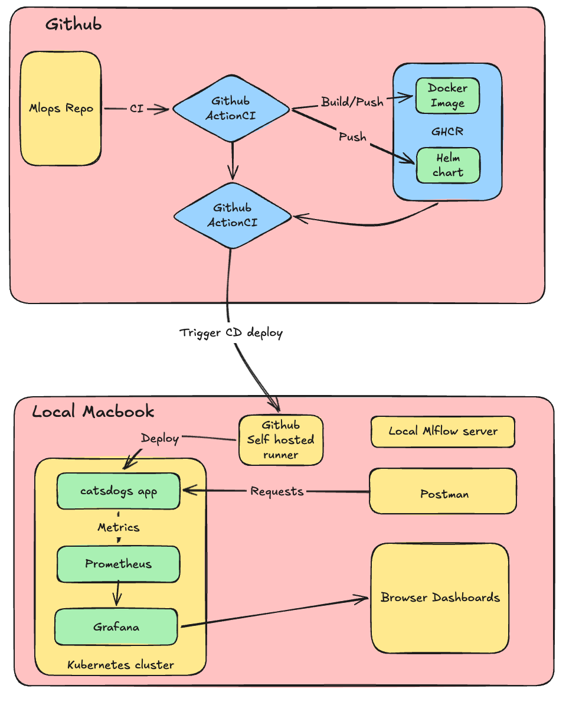

# MLOPS Assignment 2 Group-96

# Cats vs Dogs — End-to-End MLOps Pipeline

This repository implements a complete **MLOps pipeline** for **binary image classification (Cats vs Dogs)**:

- Data preprocessing to **224×224 RGB** with **80/10/10** train/val/test split
- Baseline CNN training with **MLflow** experiment tracking
- Containerised inference API using **FastAPI**
- Automated **CI** via **GitHub Actions** on a **self-hosted runner** — tests → train → Docker build → push to **GHCR**
- Automated **CD** via GitHub Actions — Helm deploy to a local Kubernetes cluster
- **DVC** pipeline for reproducible preprocessing + training steps
- Helm chart for Kubernetes deployment

---

## CI/CD Architecture



---

## 1) Project Structure

```
mlops/
├── src/
│   ├── api/
│   │   └── app.py              # FastAPI service: /health, /predict
│   ├── utils/
│   │   ├── preprocess.py       # image resize, split, numpy helpers
│   │   └── metrics.py          # accuracy, precision, recall, F1, confusion
│   ├── model.py                # SimpleCNN (3-layer, 224×224 input)
│   ├── preprocess.py           # CLI wrapper — runs split_dataset
│   ├── train.py                # training loop + MLflow logging
│   └── evaluate.py             # test-set evaluation
├── tests/
│   ├── test_preprocess.py      # unit tests: resize, numpy load, split_dataset
│   └── test_inference_utils.py # unit tests: tensor preprocessing, model forward
├── scripts/
│   ├── setup_dataset.py        # helper to unpack Kaggle zip → data/raw
│   ├── init_model_weights.py   # generate random model.pt for smoke testing
│   ├── test_api.py             # end-to-end API sanity check
│   └── smoke_test.sh           # curl-based health + predict smoke test
├── helm/
│   └── catsdogs/               # Helm chart for Kubernetes deployment
│       ├── Chart.yaml
│       ├── values.yaml
│       └── templates/
├── models/
│   └── model.pt                # trained weights (gitignored, produced by CI)
├── data/
│   ├── raw/                    # gitignored — place Kaggle data here
│   └── processed/              # gitignored — generated by preprocess step
├── .github/workflows/
│   ├── ci.yml                  # test → train → build → push to GHCR
│   └── cd.yml                  # Helm deploy to local k8s (triggered by CI)
├── Dockerfile
├── docker-compose.yml
├── dvc.yaml                    # DVC stages: preprocess + train
├── params.yaml                 # DVC/training hyperparameters
└── requirements.txt
```

---

## 2) Dataset Setup

Download the [Kaggle Cats vs Dogs](https://www.kaggle.com/c/dogs-vs-cats) dataset, then run:

```bash
python scripts/setup_dataset.py --zip path/to/archive.zip
# — or if already extracted —
python scripts/setup_dataset.py --extracted path/to/extracted/folder
```

This normalises the folder structure to:

```
data/raw/
  cats/   ← all cat images
  dogs/   ← all dog images
```

> `data/raw/` and `data/processed/` are gitignored. Use DVC to version datasets against a remote.

---

## 3) Preprocess (224×224 + split)

**Via DVC (recommended):**

```bash
dvc repro preprocess
```

**Manually:**

```bash
PYTHONPATH=. python -m src.preprocess \
  --raw_dir data/raw \
  --processed_dir data/processed
```

Output:

```
data/processed/
  train/cats, train/dogs   (80 %)
  val/cats,   val/dogs     (10 %)
  test/cats,  test/dogs    (10 %)
```

---

## 4) Train + Track Experiments (MLflow)

**Via DVC:**

```bash
dvc repro train
```

**Manually:**

```bash
PYTHONPATH=. python -m src.train \
  --epochs 10 --batch_size 32 --lr 0.001
```

**View MLflow UI:**

```bash
mlflow ui --backend-store-uri sqlite:///mlflow.db
```

Open `http://127.0.0.1:5000`

Artifacts logged per run:

| Item                                      | Location                              |
| ----------------------------------------- | ------------------------------------- |
| Hyperparameters                           | MLflow params                         |
| Per-epoch metrics (loss, accuracy, F1 …) | MLflow metrics                        |
| Best model weights                        | `models/model.pt` + MLflow artifact |
| Full MLflow model                         | `mlflow_model/` artifact            |

---

## 5) Run Inference Service

### Option A — Python (local)

```bash
PYTHONPATH=. uvicorn src.api.app:app --host 0.0.0.0 --port 8000
```

### Option B — Docker

```bash
docker build -t catsdogs:latest .
docker run -p 8000:8000 -e MODEL_PATH=models/model.pt catsdogs:latest
```

### Option C — Docker Compose

```bash
docker compose up -d --build
```

**Health check:**

```bash
curl http://localhost:8000/health
# {"status":"ok","service":"cats-dogs-inference"}
```

**Predict:**

```bash
curl -X POST http://localhost:8000/predict \
  -F "file=@/path/to/image.jpg"
```

---

## 6) Unit Tests

```bash
PYTHONPATH=. pytest tests/ -v
```

| File                        | Tests                                                            |
| --------------------------- | ---------------------------------------------------------------- |
| `test_preprocess.py`      | `preprocess_image_to_rgb_224`, `load_image_as_numpy_rgb_224` |
| `test_inference_utils.py` | `preprocess_pil_to_tensor`, `model forward shape`            |

---

## 7) CI Pipeline (GitHub Actions — Self-Hosted Runner)

**Workflow:** [.github/workflows/ci.yml](.github/workflows/ci.yml)
**Triggers:** every `push` to any branch; every `pull_request` targeting `main`
**Runner label:** `[self-hosted, mac-k8s]`

### Jobs

```
test-and-train
  ├── Checkout
  ├── Set up Python 3.10
  ├── pip install -r requirements.txt
  ├── pytest tests/ -v --tb=short          ← unit tests (must pass)
  ├── python -m src.train --epochs 1        ← trains a real model
  └── upload-artifact: models/model.pt      ← passes model to next job

build-and-push  (needs: test-and-train)
  ├── Checkout
  ├── download-artifact: models/model.pt    ← model baked into image
  ├── docker/login-action → ghcr.io         ← main branch only
  ├── docker/metadata-action                ← sha-<sha>, latest, branch tags
  ├── docker/build-push-action              ← pushes on main
  ├── helm package helm/catsdogs
  └── helm push → oci://ghcr.io/.../charts  ← main branch only
```

### Image tags produced

| Tag                  | When               |
| -------------------- | ------------------ |
| `sha-<7-char-sha>` | every push         |
| `latest`           | push to `main`   |
| `<branch-name>`    | push to any branch |
| `pr-<number>`      | pull request       |

### Registry

Images are published to **GitHub Container Registry**:

```
ghcr.io/<github-owner>/catsdogs:<tag>
```

Authentication uses the automatic `GITHUB_TOKEN` — no extra secrets needed.

---

## 8) CD Pipeline (GitHub Actions — Self-Hosted Runner)

**Workflow:** [.github/workflows/cd.yml](.github/workflows/cd.yml)
**Trigger:** CI workflow completes successfully on `main`
**Runner label:** `[self-hosted, mac-k8s]`

```
check-ci  → gate: only proceeds if CI succeeded

deploy
  ├── Checkout
  ├── helm registry login ghcr.io
  ├── kubectl create secret docker-registry ghcr-secret
  ├── helm upgrade --install catsdogs oci://ghcr.io/.../charts/catsdogs
  │     --set image.tag=sha-<sha>
  ├── kubectl rollout status deployment/catsdogs
  └── kubectl port-forward + curl /health  (smoke test)
```

---

## 9) Kubernetes / Helm Deployment (Manual)

```bash
# Log in to GHCR for Helm OCI
echo $GITHUB_TOKEN | helm registry login ghcr.io -u <username> --password-stdin

# Install / upgrade
helm upgrade --install catsdogs \
  oci://ghcr.io/<owner>/charts/catsdogs \
  --version 0.1.0 \
  --set image.tag=sha-<sha> \
  --namespace default --wait

# Verify
kubectl get pods
kubectl port-forward svc/catsdogs-svc 8000:8000
curl http://localhost:8000/health
```

---

## 10) Generating a Random Model (No Training Required)

If you want to spin up the API without training:

```bash
PYTHONPATH=. python scripts/init_model_weights.py
```

This writes randomly initialised weights to `models/model.pt`. Predictions will be random-quality but the full stack is testable.

---

## 11) DVC Pipeline Reference

```yaml
# dvc.yaml stages
preprocess:
  cmd: python -m src.preprocess --raw_dir data/raw --processed_dir data/processed
  deps: [src/preprocess.py, src/utils/preprocess.py]
  outs: [data/processed]

train:
  cmd: python -m src.train --epochs 10 --batch_size 32 --lr 0.001
  deps: [src/train.py, src/model.py, data/processed]
  outs: [models/model.pt]
```

Hyperparameters live in `params.yaml` and are tracked by DVC.
